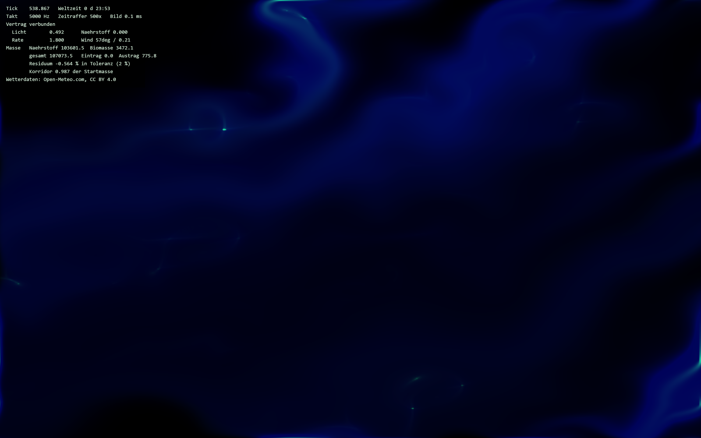

<div align="center">

# Ökosystem im Bilderrahmen

**Ein künstliches Ökosystem, das in einem Bilderrahmen an der Wand in Echtzeit läuft — über Monate, gekoppelt an das echte Wetter des Standorts.**




<sub>Bachelorarbeit Media Engineering · TH Nürnberg Georg Simon Ohm</sub>

</div>

[Was es macht](#was-es-macht) · [Screenshots](#screenshots) · [Setup](#setup) · [Status](#status) · [Dauerbetrieb](#dauerbetrieb) · [Dokumentation](#dokumentation)

## Was es macht

Ein Reaktions-Diffusions-System läuft als GLSL-Fragment-Shader mit Ping-Pong-FBOs auf WebGL2 und
bildet Nährstoff und Biomasse in einem geschlossenen Stoffkreislauf ab. Ein Python-Dienst daneben
holt stündlich das echte Wetter des Standorts von Open-Meteo und speist es als Klimakanal ein —
Licht, Wachstumsrate und Wind ändern sich damit über Stunden. Musik im Raum wirkt als zweiter,
schneller Kanal über Sekunden. Sechs Kopplungen mit sechs verschiedenen Angriffspunkten verbinden
Umwelt und Simulation; ein lokal laufendes Sprachmodell führt aus dem Simulationszustand ein
Logbuch der Welt. Alle Parameter stehen in genau einer Datei, `config/params.yaml`.

## Screenshots

<table>
<tr>
<td width="50%">

<sub><b>Mit Diagnose-Overlay.</b> Weltzeit 0 d 23:53 nach drei Minuten Realzeit im Zeitraffer 500×. Das Overlay zeigt Takt, Klimawerte und die Massenbilanz: Residuum −0,564 % bei 2 % Toleranz — der Kreislauf schliesst.</sub>
</td>
<td width="50%">

<sub><b>Das Bild der Welt.</b> Dasselbe ohne Overlay. Blau ist Nährstoff, die hellen Punkte sind Biomasse. <b>Bewusst ungestaltet</b> — Farbgebung ist nicht Teil von Prototyp 0.</sub>
</td>
</tr>
</table>

> Die Anzeige ist ein Diagnosewerkzeug, kein gestaltetes Bild. `sim/index.html` hält das
> ausdrücklich fest: Look-Development ist nicht Teil von Prototyp 0. Nach knapp einem Welttag
> liegt die Biomasse bei rund 3 % der Gesamtmasse — mehr ist schlicht nicht da.

---

## Setup

Zwei Kommandos, **beide aus dem Projektwurzelverzeichnis**:

```bash
uv run --project core uvicorn frame_core.api:app --port 8000
```

```bash
cd sim && npm run dev
```

Danach `http://localhost:5173` im Browser öffnen.

**Wichtig:** Der erste Befehl muss aus dem Projektwurzelverzeichnis laufen,
nicht aus `core/`. `core` sucht `config/params.yaml` relativ zum
Arbeitsverzeichnis; `uv run --project core` findet das uv-Projekt unabhängig
davon, von wo aus es aufgerufen wird, und lässt das Arbeitsverzeichnis dabei
auf der Wurzel. Ein `cd core && uv run uvicorn ...` bricht dagegen beim Start
mit `FileNotFoundError: config/params.yaml` ab, weil dieser Pfad von `core/`
aus nicht existiert.

Beide Kommandos sind am 2026-08-30 in einer frischen Shell durchgelaufen.

---

## Status

**Stand: Phase 4 (Dauerbetrieb).** Simulation, Umweltdienst, Metrikspeicher, Regeldetektor und
Chronikpipeline laufen (Phasen 0–3); Phase 4 ergänzt Soak-Auswertung, Watchdog und dieses
README (PLAN.md §5).

### Verifiziert am 2026-08-30

| | |
|---|---|
| `npm run build` (sim) | `tsc --noEmit` fehlerfrei, 20 Module, 153 ms, 42,96 kB (16,53 kB gzip) |
| `pytest` (core) | **78 Tests**, 0 Fehler |
| `core` | FastAPI auf :8000, `/health` antwortet |
| Wetteranbindung | **real** — 216 Stundenwerte von `archive-api.open-meteo.com` für 49.4521 / 11.0767 |
| WebSocket-Vertrag | `Vertrag verbunden` zwischen `sim` und `core` |
| Massenbilanz | Residuum **−0,564 %** bei 2 % Toleranz, Korridor 0.987 der Startmasse |
| Simulationstempo | knapp ein Welttag in 180 s Realzeit, Bildzeit 0,1 ms |

### `UNVERIFIED`

Folgendes wurde beim letzten Durchlauf nicht ausgelöst und ist unbelegt: die **Chronikpipeline**
samt lokalem Sprachmodell (`chronicle_backend: single` gemeldet, aber kein Eintrag erzeugt), der
**Regeldetektor** ausserhalb der Unit-Tests, der **Watchdog**, der **Soak-Modus**, die
**Snapshot-Wiederaufnahme** (der Lauf startete frisch) und der **Dauerbetrieb über Wochen** —
letzterer naturgemäss nicht in einer Sitzung prüfbar.

### Bekannte Einschränkungen

- **Das Browserfenster muss sichtbar bleiben.** Chrome drosselt Zeitgeber und GPU-Arbeit in
  verborgenen Tabs um den Faktor zehn (docs/annahmen.md A16). Details unter [Dauerbetrieb](#dauerbetrieb).
- **`config/params.yaml` steht auf Zeitraffer, nicht auf Feldbetrieb.** Zwei Werte müssen vor
  dem echten Betrieb zurückgesetzt werden — siehe [Laufparameter zurücksetzen](#vor-dem-feldbetrieb-laufparameter-zurücksetzen).
- **Headless-Browser stürzen ab.** Der Shader-Aufbau (Ping-Pong-FBOs mit Float-Texturen) bringt
  Chromium im Headless-Shell zum Absturz. Für automatisierte Aufnahmen braucht es ein echtes
  Fenster mit GPU.
- **Keine Darstellungsgestaltung.** Ausdrücklich nicht Teil von Prototyp 0.

---

## Dauerbetrieb

Das Objekt soll Wochen bis Monate unbeaufsichtigt laufen (Exposé §7.4). Drei
Werkzeuge dafür:

### Watchdog

`scripts/watchdog.py` startet `core` als Kindprozess, überwacht ihn und
startet ihn bei einem Absturz mit wachsender Wartezeit (Backoff) neu. Jeder
Neustart wird als eigene Zeile in `data/health.jsonl` festgehalten — im
selben Format, das `core` selbst für sein Health-Log verwendet (siehe
`core/src/frame_core/health/log.py`). Der Neustartzähler ist Teil der
Auswertung, kein Beiwerk: `scripts/soak_report.py` liest ihn mit aus.

```bash
uv run --project core python scripts/watchdog.py
```

Reines Python — Standardbibliothek plus das, was `core/pyproject.toml` ohnehin
mitbringt (`pydantic`, `pyyaml`), keine zusätzliche Abhängigkeit. Beenden mit
Strg+C fährt `core` sauber herunter, statt es hart abzubrechen. Alle Optionen
(Backoff-Parameter, Obergrenze der Neustarts, ein abweichender Startbefehl für
Testläufe ohne echtes `core`):

```bash
python scripts/watchdog.py --help
```

`--help` läuft mit jedem Python 3, auch ohne `core/.venv` — die eigentliche
Überwachung braucht dagegen die Abhängigkeiten aus `core/pyproject.toml` und
sollte deshalb über `uv run --project core python scripts/watchdog.py`
gestartet werden.

### Soak-Modus (Zeitraffer-Dauertest)

`sim` durchläuft im Soak-Modus selbstständig eine feste Anzahl Welttage im
Zeitraffer, statt auf Wanduhrzeit zu warten:

```
http://localhost:5173/?soak=<Welttage>
```

Nach Abschluss (Konsolenmeldung „Soak fertig: …“) die Auswertung:

```bash
uv run --project core python scripts/soak_report.py
```

Das Skript liest Metrikdatenbank und Health-Log und beantwortet die
Abnahmekriterien — Überleben, Massenbilanz (Residualsaldo), Klimakanal,
Chronik, Betrieb — mit Zahlen statt mit Eindrücken.

**Das Browserfenster muss dabei sichtbar bleiben** (docs/annahmen.md A16).
Chrome drosselt Zeitgeber und GPU-Arbeit in verborgenen Tabs um den Faktor
zehn — gemessen rund 10.000 Ticks/s bei sichtbarem Fenster gegenüber rund
1.000 Ticks/s bei verborgenem. Im späteren Kioskbetrieb ist das Fenster
ohnehin dauerhaft im Vordergrund; am Entwicklungsrechner während eines
Messlaufs nicht minimieren und nicht von einem anderen Fenster verdecken
lassen.

### Vor dem Feldbetrieb: Laufparameter zurücksetzen

`config/params.yaml` steht aktuell auf einen Zeitrafferlauf über echtes
Archivwetter (docs/annahmen.md A11) und **nicht** auf Feldbetrieb. Vor dem
tatsächlichen Betrieb im Wohnraum eines Studienhaushalts müssen zwei Werte
zurückgesetzt werden:

| Schlüssel | aktuell (Zeitraffer-Testlauf) | Feldbetrieb |
|---|---|---|
| `environment.epoch` | ein zurückliegendes Datum | `null` |
| `sim.speed` | `500.0` | `1.0` |

`epoch: null` lässt die Weltzeit beim Laufbeginn anfangen und mit der
Wanduhrzeit zusammenfallen, sodass das Objekt das tatsächliche Wetter von
draußen zeigt. `speed: 1.0` ist die einzige Einstellung, bei der `sim.dt_base`
tatsächlich eine Weltsekunde je Wanduhrsekunde ergibt — bei jedem höheren Wert
läuft die Welt der Wirklichkeit voraus und der Klimakanal passt nicht mehr
zusammen (docs/annahmen.md A11). Beide Werte stehen in `config/params.yaml`
mit ausführlicher Begründung an ihrer jeweiligen Stelle.

---

## Struktur prüfen

```bash
uv run --with pyyaml python scripts/verify_structure.py
```

Prüft, dass genau sechs Kopplungen mit sechs verschiedenen Angriffspunkten
existieren, dass alle in der Dokumentation genannten Parameter in
`config/params.yaml` vorhanden sind und dass die Interaktionsform nirgends —
auch nicht implizit — festgelegt wurde. Läuft ohne installierte Abhängigkeiten.

---

## Dokumentation

| Datei | Inhalt |
|---|---|
| [`PLAN.md`](PLAN.md) | Was gebaut wird, Architektur, Phasen, Definition of Done |
| [`docs/expose.md`](docs/expose.md) | Das Exposé — verbindliche Spezifikation |
| [`docs/contract.md`](docs/contract.md) | WebSocket-Vertrag zwischen `sim` und `core` |
| [`docs/mapping.md`](docs/mapping.md) | Die sechs Kopplungen und ihre Angriffspunkte |
| [`docs/annahmen.md`](docs/annahmen.md) | Jede getroffene Annahme mit Begründung |
| [`CLAUDE.md`](CLAUDE.md) | Arbeitsregeln für dieses Repository |
| [`config/params.yaml`](config/params.yaml) | Die einzige Konfigurationsdatei |

---

## Aufbau

```
core/    Python 3.13, FastAPI — Umweltdienst, Metrik, Detektor, Chronik
sim/     TypeScript, Vite, WebGL2 — Simulation als GLSL-Fragment-Shader
config/  params.yaml — jeder Parameter des Systems
docs/    Exposé, Verträge, Annahmen
scripts/ Auswertung (soak_report.py), Strukturprüfung (verify_structure.py),
         Watchdog (watchdog.py)
data/    Laufzeitdaten (nicht versioniert)
```

---

## Voraussetzungen

- **Python 3.13** — projektlokal über [`uv`](https://docs.astral.sh/uv/);
  `uv sync` in `core/` holt den Interpreter mit. Die Version ist gesetzt, damit
  Entwicklungs- und Zielumgebung denselben Interpreter benutzen — die frühere
  Obergrenze `<3.14` kam von CrewAI und ist mit dessen Wegfall in Phase 3
  entfallen.
- **Node 25.x** (siehe PLAN.md §8) für `sim/`. Verifiziert mit 26.7.0.
- **GPU mit WebGL2** und `EXT_color_buffer_float`. Kein CUDA nötig und keines
  verwendet — entwickelt auf AMD RX 7600 XT.
- **[LM Studio](https://lmstudio.ai/)** mit einem geladenen Modell und
  gestartetem lokalem Server auf `http://localhost:1234/v1`. Modellname in
  `config/params.yaml` unter `chronicle.model`.

Ein Internetzugang wird ausschließlich für Open-Meteo gebraucht. Der
Chronikpfad läuft vollständig lokal.

---

## Datenschutz

Aus dem Audiosignal werden ausschließlich Pegel in zwei Frequenzbändern
gewonnen. Es findet keine Spracherkennung statt, es wird nichts gespeichert, und
es existiert kein Puffer über das FFT-Fenster hinaus. Kein Audiosignal verlässt
das Gerät. Der Ereigniskanal ist abschaltbar — das System läuft dann auf dem
Klimakanal weiter.

---

## Attribution

Wetterdaten von [Open-Meteo.com](https://open-meteo.com/), lizenziert unter
[CC BY 4.0](https://creativecommons.org/licenses/by/4.0/).

---

## Lizenz

Noch nicht festgelegt.
